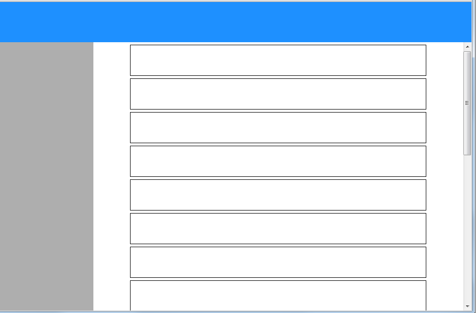

# Exercise 1 - HTML & CSS - Basic Layout

### Duration
`0.5 day`

### Code Review
`Trainer`

## Summary
In the first exercise, we are going to focus on layout.
* Display Types - understand the differences between block and inline
* Position Types - how absolute and relative positioning works

## Guidelines
* CSS will be placed in a dedicated stylesheet file and linked to the HTML file
* CSS Classes will be named in kebab-case format
* Chrome DevTools is important, use it!

## Tasks
* Create a index.html file & styles.css file
* The page will be seperated into 3 components: toolbar, navigation panel and content
* The content should be scrollable

