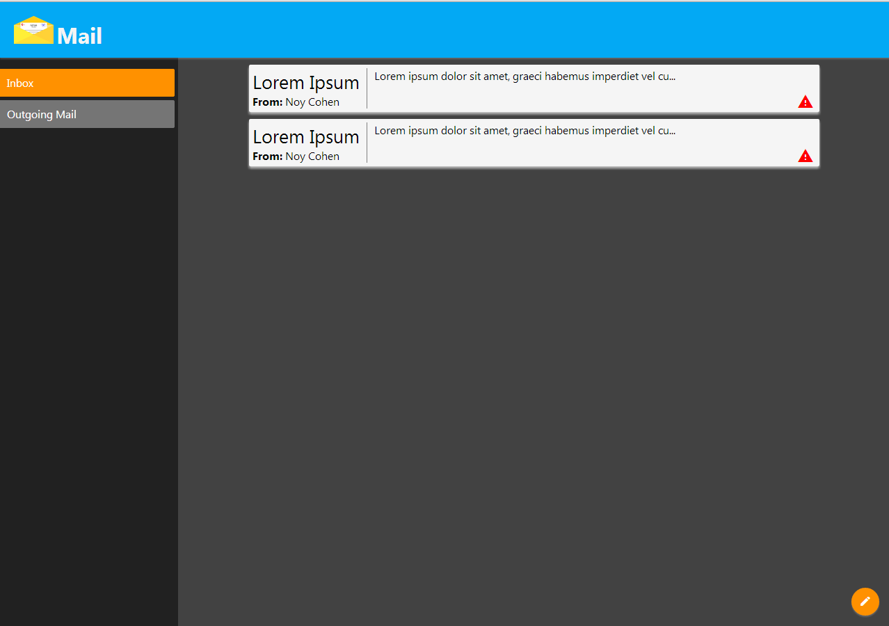

# Exercise 2 - Pixel Perfect

### Duration
`1 day`

### Code Review
`Trainer`

## Summary
This exercise expands the first exercise. We will now transform your page into an email client website!

## Guidelines
* Toolbar should now contain a logo and a title
* Navigation Panel will have 2 available options: Inbox and Outbox
* Content will have a list of emails, each with a subject, sender name, preview, and email importance.
* New mail Button will be added

### That's how it should look

